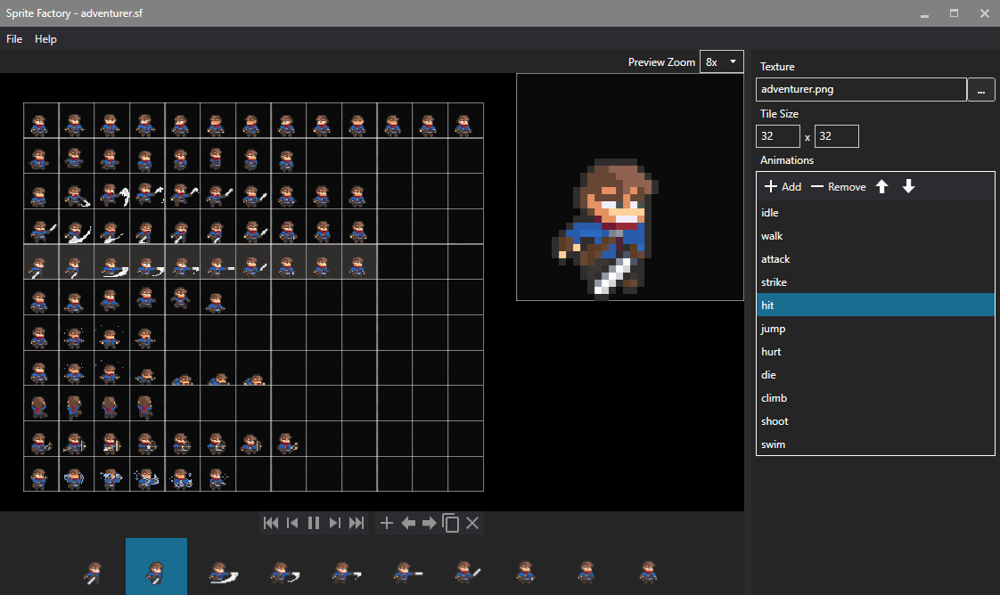

# Sprite Factory

An open source sprite sheet animation editor.



## What does it do?

I made Sprite Factory to solve a very specific problem. Sometimes you find awesome art on the internet and you want to animate it for your game.


<small>credit: [Eltan](https://www.patreon.com/posts/pig-sprites-30296626)</small>

You could always hand roll the animations in code but that can get tedious pretty quickly. Especially if you've got a lot of content to animate.

Or you could [download Sprite Factory](https://craftworkgames.itch.io/sprite-factory) and spend a few minutes creating the animations and saving them as JSON files.

```json
{
  "textureAtlas": {
    "texture": "adventurer.png",
    "regionWidth": 32,
    "regionHeight": 32
  },
  "cycles": {
    "idle": {
      "frames": [0,1,2,3,4,5,6,7,8,9,10,11,12],
      "isLooping": true
    },
    "walk": {
      "frames": [13,14,15,16,17,18,19,20],
      "isLooping": false
    }
  }
}
```

Then you can load them into your game** and get on with game development.

```cs
var spriteSheet = Content.Load<SpriteSheet>("Animations/adventurer.sf", new JsonContentLoader());
var sprite = new AnimatedSprite(spriteSheet);
sprite.Play("idle");
```

** The loading code above currently works in the `develop` branch of [MonoGame.Extended](https://github.com/craftworkgames/MonoGame.Extended)

## Wait, it's really open source and free?

There aren't many open source editor type tools around that use MonoGame under the hood. I thought it might be nice to have this as an example of what can be done. It's my hope that having the code open will inspire others to create more tools.

I have a few other ideas for tools in the works. If you like what I'm doing  check out my [patreon page](https://www.patreon.com/craftworkgames) for some other awesome things.

## What's left to do?

The main problem with the tool right now is actually loading the files into MonoGame. I've written a basic loader in the `develop` branch of MonoGame.Extended but I've been struggling to get it working with the MonoGame Content Pipeline. I would love some help with this.

Right now the tool only works with this one specific type of sprite sheet layout. There's plenty of room for improvement to add more features to the tool for sprite sheets that are packed differently, or even add a texture packer to the tool itself.
